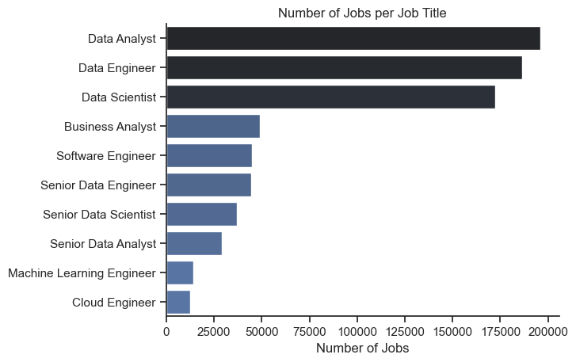
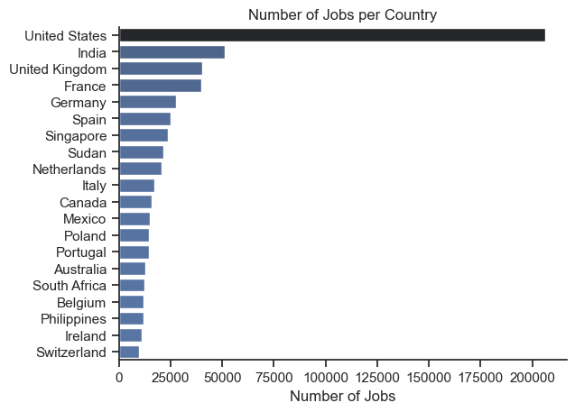
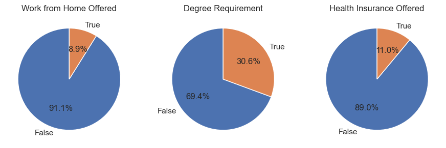
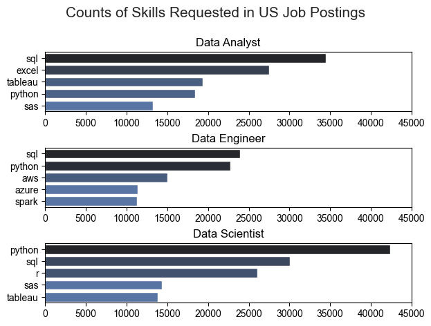
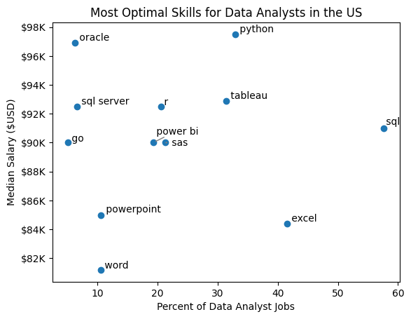
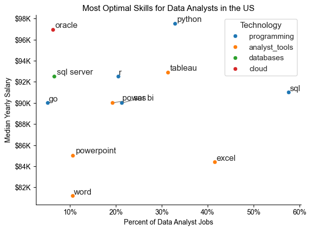

# Data Job Market Analysis

## Overview

Welcome to my analysis of the data job market, focusing on data analyst roles. This project was created out of a desire to navigate and understand the job market more effectively. It delves into the top-paying and in-demand skills to help find optimal job opportunities for data analysts.


The data is sourced from [Luke Barousse's Python Course](https://lukebarousse.com/python), which provides a foundation for my analysis, containing detailed information on job titles, salaries, locations, and essential skills. Through a series of Python scripts, I explore key questions such as the most demanded skills, salary trends, and the intersection of demand and salary in data analytics.

## The Questions

Below are the questions I want to answer in my project:

1. What are the skills most in demand for the top 3 most popular data roles? [1_Skills_Demand.ipynb](1_Skills_Demand.ipynb)
2. How are in-demand skills trending for Data Analysts? [2_Skills_Trend.ipynb](2_Skills_Trend.ipynb)
3. How well do jobs and skills pay for Data Analysts? [3_Salary_Analysis.ipynb](3_Salary_Analysis.ipynb)
4. What are the optimal skills for data analysts to learn? (High Demand AND High Paying) [4_Optimal_Skills.ipynb](4_Optimal_Skills.ipynb)

## Tools I Used

For my deep dive into the data analyst job market, I harnessed the power of several key tools:

- **Python:** The backbone of my analysis, allowing me to analyze the data and find critical insights.I also used the following Python libraries:
    - **Pandas Library:** This was used to analyze the data. 
    - **Matplotlib Library:** I visualized the data.
    - **Seaborn Library:** Helped me create more advanced visuals. 
- **Jupyter Notebooks:** The tool I used to run my Python scripts which let me easily include my notes and analysis.
- **Visual Studio Code:** My go-to for executing my Python scripts.
- **Git & GitHub:** Essential for version control and sharing my Python code and analysis, ensuring collaboration and project tracking.

## Data Preparation and Cleanup

This section outlines the steps taken to prepare the data for analysis, ensuring accuracy and usability.

### Import & Clean Up Data

I start by importing necessary libraries and loading the dataset, followed by initial data cleaning tasks to ensure data quality.

```python
# Importing Libraries
import ast
import pandas as pd
import seaborn as sns
from datasets import load_dataset
import matplotlib.pyplot as plt  

# Loading Data
dataset = load_dataset('lukebarousse/data_jobs')
df = dataset['train'].to_pandas()

# Data Cleanup
df['job_posted_date'] = pd.to_datetime(df['job_posted_date'])
df['job_skills'] = df['job_skills'].apply(lambda x: ast.literal_eval(x) if pd.notna(x) else x)
```

## Exploratory Data Analysis
Before diving into the main questions, I performed an initial exploratory data analysis to understand the landscape of the job market. This involved looking at the distribution of job titles, locations, and common benefits. The full analysis can be found in the [0_Exploratory_Data_Analysis.ipynb](0_Exploratory_Data_Analysis.ipynb) notebook.

### Key Findings:
- **Job Titles**: Data Analyst, Data Scientist, and Data Engineer are the most frequent job titles.

- **Locations**: The United States dominates the job market in this dataset, followed by a significant number of postings in other global locations.

- **Job Benefits**: A large majority of job postings do not explicitly mention health insurance or a degree requirement. However, "work from home" is offered in about one-third of the roles, indicating a significant trend toward remote work.


### Filter US Jobs

To focus my analysis on the U.S. job market, I apply filters to the dataset, narrowing down to roles based in the United States.

```python
df_US = df[df['job_country'] == 'United States']
```

## The Analysis

Each Jupyter notebook for this project aimed at investigating specific aspects of the data job market. Here’s how I approached each question:

### 1. What are the most demanded skills for the top 3 most popular data roles?

To find the most demanded skills, I filtered for the top 3 most popular data roles: **Data Analyst, Data Scientist, and Data Engineer**. I then identified the **top 5 skills** for each of these roles. This analysis highlights the core competencies required for each job title, showing which skills job-seekers should prioritize depending on their target role.

View my notebook with detailed steps here: [1_Skills_Demand](1_Skills_Demand.ipynb).

#### Visualize Data Results




*Bar graph visualizing the salary for the top 3 data roles and their top 5 skills associated with each.*

#### Insights:

- **SQL is a universal requirement**, appearing in the top skills for all three major data roles and being the most demanded skill for both Data Analysts (51%) and Data Scientists (51%).
- **Python is the top skill for Data Engineers** (68% of postings) and the second most demanded skill for Data Scientists (72%), highlighting its importance for more technical data roles.
- **Data Engineers require more specialized technical skills** like AWS, Azure, and Spark, while Data Analysts and Data Scientists focus on a mix of database (SQL), programming (Python, R), and visualization tools (Tableau, Power BI).

### 2. How are in-demand skills trending for Data Analysts?

To understand how skill demands are trending for Data Analysts, I filtered for US-based Data Analyst positions and grouped the required skills by the month of the job posting throughout 2023. This analysis reveals the evolving importance of the top 5 data analyst skills over the year.

View my notebook with detailed steps here: [2_Skills_Trend](2_Skills_Trend.ipynb).

#### Visualize Data

```python
from matplotlib.ticker import PercentFormatter

df_plot = df_DA_US_percent.iloc[:, :5]
sns.lineplot(data=df_plot, dashes=False, legend='full', palette='tab10')

plt.gca().yaxis.set_major_formatter(PercentFormatter(decimals=0))

plt.show()
```

#### Results

  

*Bar graph visualizing the trending top skills for data analysts in the US in 2023.*

#### Insights:
- **SQL remains the most consistently demanded skill** throughout the year, although it shows a slight gradual decrease in demand from its peak in January.
- **Excel experienced a significant increase in demand** starting around September, surpassing both Python and Tableau by the end of the year to become the second most demanded skill.
- **Python and Tableau show relatively stable demand** throughout the year with minor fluctuations, remaining essential skills for data analysts.

### 3. How well do jobs and skills pay for Data Analysts?

To identify the highest-paying roles and skills, I focused on jobs in the United States and analyzed their median salaries. I first examined the salary distributions of the top 6 data jobs to understand the general pay landscape before drilling down into the specifics for Data Analysts. 

View my notebook with detailed steps here: [3_Salary_Analysis](3_Salary_Analysis.ipynb).

##### Visualize Data 

```python
sns.boxplot(data=df_US_top6, x='salary_year_avg', y='job_title_short', order=job_order)

ticks_x = plt.FuncFormatter(lambda y, pos: f'${int(y/1000)}K')
plt.gca().xaxis.set_major_formatter(ticks_x)
plt.show()

```

##### Results

  

*Box plot visualizing the salary distributions for the top 6 data job titles.*

##### Insights

- There's a significant variation in salary ranges across different job titles. **Senior roles (Senior Data Scientist, Senior Data Engineer) have the highest median salaries and the widest pay bands**, indicating high value placed on advanced skills and experience.

- Data Analyst roles, while having a lower median salary, show more salary consistency with fewer high-end outliers compared to more senior or specialized roles.

- The median salaries clearly increase with the seniority and specialization of the roles, reflecting greater variance in compensation as responsibilities increase.

#### Highest Paid & Most Demanded Skills for Data Analysts

Next, I focused my analysis solely on data analyst roles to compare which skills are the highest-paying versus those that are most in-demand.

##### Visualize Data

```python

fig, ax = plt.subplots(2, 1)  

# Top 10 Highest Paid Skills for Data Analysts
sns.barplot(data=df_DA_top_pay, x='median', y=df_DA_top_pay.index, hue='median', ax=ax[0], palette='dark:b_r')

# Top 10 Most In-Demand Skills for Data Analystsr')
sns.barplot(data=df_DA_skills, x='median', y=df_DA_skills.index, hue='median', ax=ax[1], palette='light:b')

plt.show()

```

##### Results


*Two bar graphs visualizing the highest-paid skills versus the most in-demand skills for data analysts in the US.*

##### Insights:

- **Specialized technical skills command the highest salaries.** Skills related to big data technologies (`dplyr`), DevOps (`Bitbucket`, `Gitlab`), and niche programming (`Solidity`) are associated with top-tier salaries, some exceeding $150K.

- **Foundational skills are the most in-demand.** Core tools like SQL, Excel, and Tableau are the most frequently requested skills, though their median salaries are more moderate (in the $85K-$95K range).

- There is a clear trade-off between skill prevalence and salary. While niche skills offer higher pay, foundational skills are essential for securing a broader range of job opportunities.

### 4. What are the most optimal skills to learn for Data Analysts?

To identify the most optimal skills—those that are both high-paying and high in demand—I plotted the median salary of skills against their prevalence in job postings for Data Analysts in the US. I also categorized skills by technology type (e.g., Programming, Database, Analyst Tool) to provide deeper insights.

View my notebook with detailed steps here: [4_Optimal_Skills](4_Optimal_Skills.ipynb).

##### Visualize Data

```python
from matplotlib.ticker import PercentFormatter
import seaborn as sns

# Create a scatter plot colored by technology
sns.scatterplot(
    data=df_DA_skills_tech_high_demand,
    x='skill_percent',
    y='median_salary',
    hue='technology',
    palette='bright',
    legend='full'
)
plt.show()
```

##### Results



*A scatter plot visualizing the most optimal skills (high-paying & high-demand) for data analysts in the US, with color labels for technology.*

##### Insights:

- **Programming and Database skills offer the highest salaries**. Python, R, Oracle, and SQL Server are located in the upper-right quadrant, signifying that they are both highly demanded and highly compensated. Oracle has the highest median salary at nearly $97K.

- **Analyst tools like Tableau and Power BI are valuable and common**. These skills are in high demand and offer competitive salaries, positioning them as optimal skills for data analysts to learn.

- **Core skills like SQL and Excel are highly prevalent but offer more average salaries**. While essential for getting a job, specializing in higher-paying skills like Python or advanced database technologies can lead to greater earning potential.

#### Visualizing Different Techonologies

Let's visualize the different technologies as well in the graph. We'll add color labels based on the technology (e.g., {Programming: Python})

##### Visualize Data

```python
from matplotlib.ticker import PercentFormatter

# Create a scatter plot
scatter = sns.scatterplot(
    data=df_DA_skills_tech_high_demand,
    x='skill_percent',
    y='median_salary',
    hue='technology',  # Color by technology
    palette='bright',  # Use a bright palette for distinct colors
    legend='full'  # Ensure the legend is shown
)
plt.show()

```

##### Results

 


*A scatter plot visualizing the most optimal skills (high paying & high demand) for data analysts in the US with color labels for technology.*

##### Insights:

- The scatter plot shows that most of the `programming` skills (colored blue) tend to cluster at higher salary levels compared to other categories, indicating that programming expertise might offer greater salary benefits within the data analytics field.

- The database skills (colored orange), such as Oracle and SQL Server, are associated with some of the highest salaries among data analyst tools. This indicates a significant demand and valuation for data management and manipulation expertise in the industry.

- Analyst tools (colored green), including Tableau and Power BI, are prevalent in job postings and offer competitive salaries, showing that visualization and data analysis software are crucial for current data roles. This category not only has good salaries but is also versatile across different types of data tasks.

## What I Learned

Throughout this project, I deepened my understanding of the data analyst job market and enhanced my technical skills in Python, especially in data manipulation and visualization. Here are a few specific things I learned:

- **Advanced Python Usage**: Utilizing libraries such as Pandas for data manipulation, and Seaborn/Matplotlib for data visualization, helped me perform complex data analysis tasks more efficiently.

- **Data Cleaning Importance**: I learned that thorough data cleaning and preparation are crucial before any analysis can be conducted, ensuring the accuracy of insights derived from the data.

- **Strategic Skill Analysis**:  The project emphasized the importance of aligning one's skills with market demand. Understanding the relationship between skill demand, salary, and job availability allows for more strategic career planning in the tech industry.


## Challenges I Faced

This project was not without its challenges, but it provided good learning opportunities:

- **Data Inconsistencies**: Handling missing or inconsistent data entries requires careful consideration and thorough data-cleaning techniques to ensure the integrity of the analysis.

- **Complex Data Visualization**: esigning effective visual representations of complex datasets was challenging but critical for conveying insights clearly and compellingly.

- **Balancing Breadth and Depth**: Deciding how deeply to dive into each analysis while maintaining a broad overview of the data landscape required constant balancing to ensure comprehensive coverage without getting lost in details.


## Conclusion

This exploration into the data analyst job market has been incredibly informative, highlighting the critical skills and trends that shape this evolving field. The insights I gained enhance my understanding and provide actionable guidance for anyone looking to advance their career in data analytics. As the market continues to change, ongoing analysis will be essential to stay ahead. This project serves as a solid foundation for future explorations and underscores the importance of continuous learning and adaptation in the data field.


